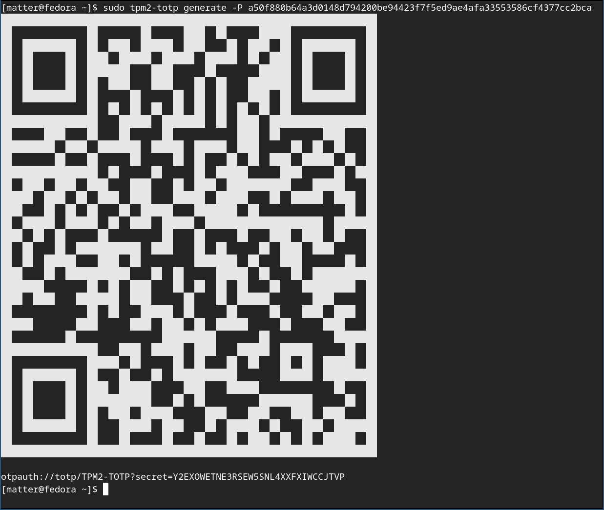
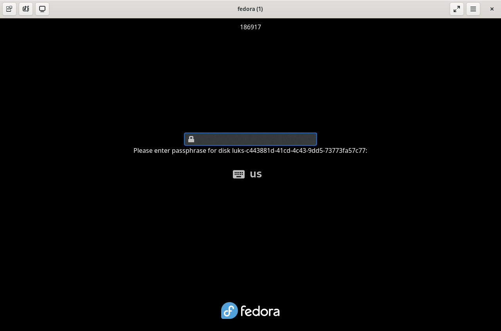

# Fedora RPM Packaging: tpm2-totp

This repository contains Fedora RPM packaging files for [`tpm2-totp`](https://github.com/tpm2-software/tpm2-totp), a tool that enables Time-based One-Time Passwords (TOTP) using a TPM 2.0 device.

This package integrates with `dracut` and `plymouth` to allow secure "remote attestation" during early boot, based on TPM-measured system state.

## Contents

- `SPECS/tpm2-totp.spec` - RPM spec file
- `SOURCES/0001-install-module-always.patch` - Patch to ensure Dracut module is installed unconditionally
- `SRPMS/tpm2-totp-0.3.0-1.fc42.src.rpm` - Source RPM (for local build or review)
- `fedora-review.txt` - Output from `fedora-review` tool

## Current Status

- This packaging is complete and builds cleanly using `rpmbuild` on Fedora 42.
- The package passes `fedora-review` with no major issues.
- GPG signature verification of the source tarball is included.
- The Dracut module is properly installed to `/usr/lib/dracut/modules.d/70tpm2-totp/`.

I do **not** plan to maintain this package long-term, but I am submitting it in hopes that an interested maintainer can review and sponsor it for inclusion in Fedora.

Bugzilla tracking this effort: [Bug 2389097 - Review Request: tpm2-totp](https://bugzilla.redhat.com/show_bug.cgi?id=2389097)

## Build Instructions

To rebuild the SRPM:

```bash
rpmbuild --rebuild tpm2-totp-0.3.0-1.src.rpm
```

## Screenshots

Generating a new TOTP secret:


TOTP attestation displayed during boot:

